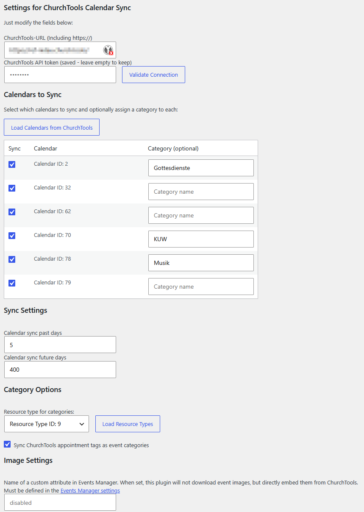

# churchtools-wp-calendarsync
This wordpress plugin does take the events from the churchtools calendar
and imports them as events in wordpress.

Updates to the events in churchtool are also updated in wordpress.

**For this plugin to be working, you need to also install and**
**configure the "Events Manager" from Pixelite**

https://de.wordpress.org/plugins/events-manager/

## Features
- Sync calendar entries from selected calendars to wordpress
- Assign categories based on source calendar
- Event categories can be assigned via churchtool resources
- The title, description and location are synced to wordpress
- The image of the calendar entry is synced to wordpress
  or optionally just referenced to churchtool
- Support for all-day events
- Sync window is specified by n days in the past and m days in the future
- Uses the modern REST api of churchtools
- Background sync every 57 minutes, plus a "Sync Now" button and a status
  display showing the last sync time and duration
- Optionally sync churchtool appointment tags as wordpress categories
- Writes a log file to a protected folder under wp-content/uploads;
  enable debug logging by defining the CTWPSYNC_DEBUG constant in wp-config.php
- Embedd event link on bottom of text or replace #LINK:<text>:# with the link
- Attach flyer from event files, link can be customized via #FLYER:Mehr infos im Flyer:#

### Room for improvement (and/or missing features)
- Configure log level from wordpress UI
- Show log in wordpress UI
- Take event information over to wordpress
- Resize large images to match template thumbnail sizes
- Simpler configuration of the plugin (More workflow and more robust)
- Fetch token via UI login/api call to churchtool
- Notify someone about sync problems
- Better error handling in the sync process
- Make plugin (and updates) available via wordpress plugins site
- Handle recurrence of events as recurrence in wp too (perhaps)

### Reason for this way of integration
One of biggest advantages of this approach is the fact,
that you can use all the events manager features, formatting
listing, ical feed etc. out of the box.

You can also add other events directly in wordpress
event manager, the church tool sync process will not touch these.

## Installation of the plugin
- Make sure to have the events manager plugin installed and activated
- Checkout the source from to the wp-content/plugins folder
  in a folder named churchtools-wpcalendarsync
- Change to this folder
- Install the dependencies with `composer install`

## Configuration of the plugin
- We recommend to create a ctsync or similar wp account,
  so all events get this user assigned as the owner.
  The cron job uses the one logged in, which did activate the plugin
- Get the url to your churchtool installation
- Get a API token, which has read access to the desired calendars
- Go to the wordpress admin page
- Activate the plugin
- Navigate to "Settings->Churchtools Calendar sync
  
- Enter your ChurchTools URL and API token, then click "Validate Connection"
  to confirm they work
- Click "Load Calendars from ChurchTools" and select which calendars to sync,
  optionally assigning a wordpress category to each
- To assign categories from resource bookings, click "Load Resource Types"
  and pick the resource type (see "Tips and tricks" below for the setup)
- Hit save. Saving no longer starts a sync on its own;
  click the "Sync Now" button to run the first sync, so be patient
- After the sync cycle is finished, the last sync and the sync duration are displayed
- After that, the sync runs automatically every 57 minutes
- In the default configuration, images and files are downloaded
  from churchtool and stored inside your wordpress installation.
  Just enable this in the wordpress config page of the plugin.
  __Please__ note, that this only works for public accessible calendars.
  
## Tips and tricks
- Event categories can be taken from churchtool
  - For this, create a new resource type like "Website categories"
  - Add all categories as resource with the given type and name
  - Mark the resource as virtual, so no booking conflicts occure
  - Mark the resource to automatically accept bookings
- You can organize the event categories (Once created by the sync process)
  in hierarchical way in wordpress
  - The sync process only looks at the category name for matching
- The wp-cron job runs every 57 minutes
  - If you wish to trigger it manually, you can install this plugin
    https://wordpress.org/plugins/wp-crontrol/
  - You can also see who is associated with the cron job, and will
    be the owner of the event entries
- Use a seaparate wordpress user for installing and configuring the 
  plugin. This way, the owner of the new events will be that user
  and you can see who created them
- Place the churchtool event link exactly where you want it
  - Put `#LINK:Your text:#` anywhere in the churchtool event information
  - It is replaced with a link to that churchtool event
  - Without the marker, a plain "Link" is appended at the bottom of the text
- Link an attached flyer inline
  - Put `#FLYER:Your text:#` in the event information
  - It is replaced with a link to the event's attached flyer file
- Serve images directly from churchtool instead of downloading them
  - Set the custom attribute name (the "em_image_attr" field) in the settings
  - The plugin then references the churchtool image URL via an Events Manager
    custom attribute instead of storing a copy in wp-content/uploads
  - A locally set image always takes precedence, and this only works for
    publicly accessible calendars
- Troubleshoot with debug logging
  - Add `define('CTWPSYNC_DEBUG', true);` to wp-config.php for verbose logging
    (this also enables the churchtools-api library's own log)
  - Logs live in wp-content/uploads/ctwpsync-logs/ and rotate at 5 MB
  - Turn it back off once you are done
- Tune the sync window
  - The "past days" and "future days" settings control how far back and
    forward events are pulled
  - Keep "past days" small so you don't import a backlog of old events
- Sync churchtool tags as categories
  - In addition to resource based categories, you can enable syncing
    churchtool appointment tags as wordpress categories

(c) 2023-2026 Aarboard a.schild@aarboard.ch
